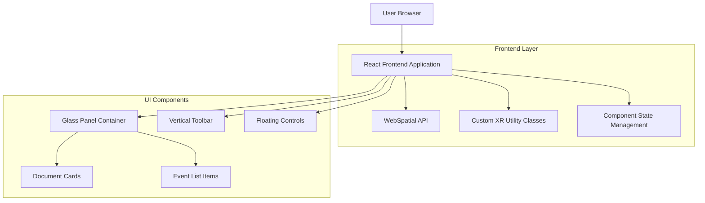

## 1. Architecture Design



## 2. Technology Description

- Frontend: React@18 + TypeScript + Vite
- Initialization Tool: vite-init
- Styling: Tailwind CSS@3 + Custom XR Utility Classes
- 3D/Spatial: WebSpatial API
- Backend: None (Static frontend application)

## 3. Route Definitions

| Route | Purpose |
|-------|---------|
| / | Homepage with glassmorphic panel, toolbar, and floating controls |

## 4. Component Architecture

### 4.1 Core Components

**GlassPanelContainer**
```typescript
interface GlassPanelProps {
  children: React.ReactNode;
  blurIntensity?: number;
  opacity?: number;
}
```

**VerticalToolbar**
```typescript
interface ToolbarProps {
  icons: string[];
  onIconClick: (index: number) => void;
}
```

**FloatingControls**
```typescript
interface FloatingControlsProps {
  buttons: ControlButton[];
  position?: 'top' | 'bottom';
}

interface ControlButton {
  icon: string;
  onClick: () => void;
}
```

**DocumentCard**
```typescript
interface DocumentCardProps {
  title: string;
  date: string;
  icon: string;
  avatar: string;
  onClick: () => void;
}
```

**EventItem**
```typescript
interface EventItemProps {
  title: string;
  timeRange: string;
  accentColor: 'cyan' | 'green' | 'yellow';
  onClick: () => void;
}
```

### 4.2 WebSpatial Integration

**XR Utility Classes**
```css
.xr-blur-light {
  backdrop-filter: blur(8px);
  -webkit-backdrop-filter: blur(8px);
}

.xr-blur-medium {
  backdrop-filter: blur(16px);
  -webkit-backdrop-filter: blur(16px);
}

.xr-glass-panel {
  background: rgba(255, 255, 255, 0.1);
  border: 1px solid rgba(255, 255, 255, 0.2);
  box-shadow: 0 8px 32px 0 rgba(31, 38, 135, 0.37);
}
```

**WebSpatial API Usage**
```typescript
import { WebSpatial } from 'webspatial';

const applySpatialBlur = (element: HTMLElement, intensity: number) => {
  const spatial = new WebSpatial();
  spatial.applyBlur(element, {
    intensity,
    quality: 'high',
    preserveEdges: true
  });
};
```

## 5. Clickable Elements Implementation

The six clickable elements as specified:
1. Document Card 1 - "Q3 Product Development …"
2. Document Card 2 - "Feature Specification …"
3. Document Card 3 - "User Flow & Interaction …"
4. Document Card 4 - "Product Roadmap Q1 …"
5. Document Card 5 - "UI/UX Design Specification"
6. Event Item - Any upcoming event (Research, Meeting Kevin)

### 5.1 Click Handlers
```typescript
const handleDocumentClick = (documentId: string) => {
  console.log(`Document clicked: ${documentId}`);
  // Add navigation or modal logic here
};

const handleEventClick = (eventId: string) => {
  console.log(`Event clicked: ${eventId}`);
  // Add event detail modal or navigation
};
```

## 6. State Management

```typescript
interface HomepageState {
  recentlyVisited: Document[];
  upcomingEvents: Event[];
  selectedDocument: string | null;
  selectedEvent: string | null;
}

interface Document {
  id: string;
  title: string;
  date: string;
  icon: string;
  avatar: string;
}

interface Event {
  id: string;
  title: string;
  timeRange: string;
  accentColor: 'cyan' | 'green' | 'yellow';
  dateGroup: 'Today' | 'Tuesday March 10';
}
```

## 7. Styling Specifications

### 7.1 Color Palette
- Header Yellow: #FFD700 (bright yellow)
- Primary Text: #FFFFFF (white)
- Secondary Text: #9CA3AF (light gray)
- Accent Colors:
  - Cyan: #06B6D4
  - Green: #10B981
  - Yellow/Orange: #F59E0B

### 7.2 Typography
- Header Font: Bold sans-serif
- Panel Title: Large, bold white
- Section Labels: Small, gray
- Card Titles: Medium weight with ellipsis truncation
- Dates/Times: Small, light gray

### 7.3 Layout Dimensions
- Glass Panel: Centered, rounded corners (border-radius: 24px)
- Card Grid: 5 equal columns
- Toolbar: Vertical stack on left edge
- Floating Controls: Pill-shaped container with 3 circular buttons
- Pagination: Single centered dot below panel