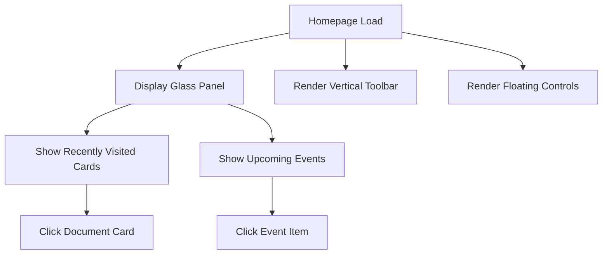

## 1. Product Overview
Restructure the existing mock Notion app homepage to match the Figma design exactly. The new homepage features a glassmorphic design with a centered blur panel, vertical toolbar, and six clickable elements as specified.

This redesign implements WebSpatial API blur effects using xr utility classes for the glassmorphism effect, creating a modern, immersive user experience that matches the provided mockup precisely.

## 2. Core Features

### 2.1 User Roles
No user roles required - this is a single-user interface demonstration.

### 2.2 Feature Module
Our homepage restructure consists of the following main components:
1. **Homepage**: Glass panel with recently visited documents and upcoming events
2. **Vertical Toolbar**: Left-side navigation with icon buttons
3. **Floating Controls**: Pill-shaped control with stacked circular buttons

### 2.3 Page Details
| Page Name | Module Name | Feature description |
|-----------|-------------|---------------------|
| Homepage | Header Section | Display "Homepage" title in bright yellow and descriptive subtitle |
| Homepage | Glass Panel Container | Apply WebSpatial blur using xr utility classes for glassmorphism effect |
| Homepage | Main Title | Show "Mock Notion" title centered at top of glass panel |
| Homepage | Recently Visited Section | Display 5 document cards with icons, titles, avatars, and dates |
| Homepage | Upcoming Events Section | Show events list with colored accent lines and time ranges |
| Homepage | Pagination Indicator | Display single active dot below main panel |
| Vertical Toolbar | Navigation Icons | Stack icon buttons vertically on left side |
| Floating Controls | Pill Container | Render floating pill with 3 stacked circular buttons |

## 3. Core Process
User Flow:
1. User lands on homepage with glassmorphic panel
2. User can click on any of the 5 recently visited document cards
3. User can click on any of the upcoming events
4. User can interact with vertical toolbar icons
5. User can use floating control buttons

## 4. User Interface Design

### 4.1 Design Style
- **Primary Colors**: Bright yellow for headers, white for main text
- **Secondary Colors**: Light gray for secondary text and dates
- **Accent Colors**: Cyan/light blue, green, yellow/orange for event lines
- **Glass Effect**: WebSpatial blur with xr utility classes
- **Typography**: Sans-serif with varying weights
- **Layout**: Centered glass panel with left toolbar and floating controls

### 4.2 Page Design Overview
| Page Name | Module Name | UI Elements |
|-----------|-------------|-------------|
| Homepage | Glass Panel | Rounded rectangle with translucent blur, soft drop shadow, inner padding |
| Recently Visited | Document Cards | Light gray translucent tiles with document icons, truncated titles, avatars |
| Upcoming Events | Event Items | White titles, gray time ranges, colored vertical accent lines |
| Toolbar | Icon Buttons | Vertically stacked navigation icons without labels |
| Controls | Floating Pill | Pill-shaped container with 3 circular buttons |

### 4.3 Responsiveness
Desktop-first design approach with the glass panel centered and fixed dimensions.

### 4.4 WebSpatial Integration
- Use WebSpatial API for blur effects
- Apply custom xr classes for glassmorphism
- Implement spatial audio if needed for interactions
- Maintain performance with optimized blur calculations