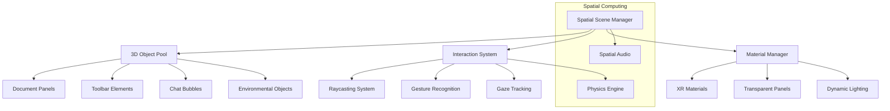

## 1. Architecture Design

```mermaid
graph TD
    A[User Browser/XR Device] --> B[WebSpatial React Application]
    B --> C[@webspatial/react-sdk]
    C --> D[Three.js Renderer]
    C --> E[WebXR Manager]
    
    subgraph "Frontend Layer"
        B
        F[Spatial Components]
        G[3D UI Elements]
        H[Interaction System]
    end
    
    subgraph "WebSpatial Framework"
        C
        D
        E
        I[Spatial Physics]
        J[Material System]
    end
    
    subgraph "Core Functionality"
        K[Document Management]
        L[Note System]
        M[AI Chat Service]
    end
    
    B --> F
    F --> G
    F --> H
    C --> I
    C --> J
    F --> K
    F --> L
    F --> M
```

## 2. Technology Description

- **Frontend**: React@19 + @webspatial/react-sdk@1.2.1 + three@0.183
- **Initialization Tool**: vite-init (already configured)
- **Spatial Framework**: @webspatial/core-sdk@1.2.1 for spatial computing APIs
- **3D Rendering**: Three.js with React Three Fiber integration
- **XR Support**: WebXR API integration through @webspatial platform plugins
- **UI Framework**: TailwindCSS@4.2 for responsive spatial UI styling
- **Build Tool**: Vite@8.0 with @webspatial/vite-plugin@1.0.1
- **Backend**: None (client-side only, leveraging existing local storage patterns)

## 3. Route Definitions

| Route | Purpose |
|-------|---------|
| / | Spatial Dashboard - Main 3D workspace with floating document panels |
| /document/:id | Spatial Document Editor - Immersive 3D editing environment |
| /ai-chat | Spatial AI Chat Interface - 3D floating conversation interface |
| /xr-preview | XR Preview Mode - Full spatial computing experience |

## 4. Component Architecture

### 4.1 Core Spatial Components

**SpatialDocumentCard Component**
```typescript
interface SpatialDocumentCardProps {
  document: {
    id: number;
    title: string;
    icon: string;
    date: string;
    color: string;
  };
  position: [number, number, number];
  rotation?: [number, number, number];
  scale?: number;
  onInteract?: () => void;
}
```

**SpatialToolbar Component**
```typescript
interface SpatialToolbarProps {
  items: Array<{
    id: number;
    icon: string;
    label: string;
    active: boolean;
  }>;
  position: [number, number, number];
  orientation?: 'vertical' | 'horizontal';
  radius?: number;
}
```

**SpatialChatInterface Component**
```typescript
interface SpatialChatInterfaceProps {
  messages: Array<{
    id: string;
    content: string;
    sender: 'user' | 'ai';
    timestamp: Date;
  }>;
  spatialConfig: {
    bubbleSpacing: number;
    maxVisibleMessages: number;
    animationSpeed: number;
  };
}
```

## 5. Spatial System Architecture



## 6. Data Models

### 6.1 Spatial Document Model
```typescript
interface SpatialDocument {
  id: string;
  title: string;
  content: string;
  icon: string;
  color: string;
  spatialPosition: [number, number, number];
  spatialRotation: [number, number, number];
  scale: number;
  lastAccessed: Date;
  createdAt: Date;
  updatedAt: Date;
}
```

### 6.2 Spatial Workspace Configuration
```typescript
interface SpatialWorkspaceConfig {
  environment: {
    type: 'living-room' | 'office' | 'custom';
    lighting: 'ambient' | 'directional' | 'mixed';
    backgroundColor: string;
  };
  panelSettings: {
    transparency: number;
    cornerRadius: number;
    shadowIntensity: number;
    material: 'thin' | 'thick' | 'glass';
  };
  interaction: {
    hoverScale: number;
    clickAnimation: string;
    gazeTimeout: number;
  };
}
```

### 6.3 WebSpatial Material Definitions

**Panel Material Configuration**
```typescript
const panelMaterial = {
  '--xr-background-material': 'thin',
  'backgroundColor': 'rgba(43, 43, 43, 0.8)',
  'borderRadius': '16px',
  'border': '1px solid rgba(255, 255, 255, 0.1)',
  'boxShadow': '0 8px 32px rgba(0, 0, 0, 0.3)',
  'backdropFilter': 'blur(10px)'
};
```

**XR-Compatible Styling**
```typescript
const xrStyles = {
  floatingPanel: {
    transform: 'translateZ(0)',
    willChange: 'transform',
    transition: 'all 0.3s cubic-bezier(0.4, 0, 0.2, 1)'
  },
  interactiveElement: {
    cursor: 'pointer',
    userSelect: 'none',
    WebkitTapHighlightColor: 'transparent'
  }
};
```

## 7. Performance Optimization

### 7.1 Spatial Rendering Pipeline
- **Frustum Culling**: Automatically hide off-screen 3D elements
- **LOD System**: Reduce geometry complexity based on distance
- **Texture Atlasing**: Combine UI textures for efficient GPU usage
- **Instanced Rendering**: Efficiently render multiple similar objects

### 7.2 XR Performance Targets
- **Frame Rate**: Maintain 72fps minimum for XR devices
- **Latency**: Sub-20ms motion-to-photon latency
- **Memory**: Efficient texture streaming and garbage collection
- **Battery**: Optimized for mobile XR device battery life

## 8. Browser Compatibility

### 8.1 WebXR Support Matrix
- **Chrome/Edge**: Full WebXR support with hand tracking
- **Firefox**: Partial WebXR support (polyfill required)
- **Safari**: WebXR not supported (fallback to 3D mode)
- **Mobile**: iOS Safari (3D mode), Android Chrome (WebXR mode)

### 8.2 Fallback Strategy
- **WebXR Available**: Full spatial computing experience
- **WebXR Unavailable**: Enhanced 3D mode with mouse/touch interaction
- **Performance Issues**: Simplified 3D mode with reduced effects
- **Legacy Browsers**: Standard 2D mode with spatial design elements