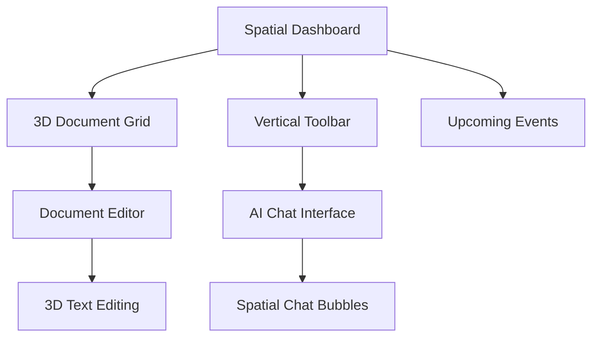

## 1. Product Overview
Transform the existing Mock Notion application into a fully spatialized web application using the WebSpatial framework. The new implementation will maintain core note-taking and document management functionality while introducing immersive 3D spatial interactions, floating panels, and environmental design elements that create a living-room workspace experience.

The spatialized application will enable users to interact with their documents, notes, and workspace elements in 3D space, providing a more intuitive and engaging productivity experience that leverages modern web-based spatial computing capabilities.

## 2. Core Features

### 2.1 User Roles
| Role | Registration Method | Core Permissions |
|------|---------------------|------------------|
| Standard User | Email/Social Auth | Create, edit, organize documents and notes in 3D space |
| Guest User | Anonymous access | View shared documents with limited spatial interactions |

### 2.2 Feature Module
Our spatialized Mock Notion application consists of the following main spatial interface pages:
1. **Spatial Dashboard**: 3D floating workspace with document cards, toolbar panels, and environmental background
2. **Document Editor**: Immersive 3D document editing environment with spatial toolbars and floating panels
3. **AI Chat Interface**: Spatial chat component with floating conversation bubbles and interactive 3D elements

### 2.3 Page Details
| Page Name | Module Name | Feature description |
|-----------|-------------|---------------------|
| Spatial Dashboard | 3D Document Grid | Display document cards as floating 3D panels with spatial positioning, hover effects, and click interactions |
| Spatial Dashboard | Vertical Toolbar | Immersive 3D toolbar with floating icons that respond to spatial interactions and gaze-based navigation |
| Spatial Dashboard | Upcoming Events Panel | 3D floating calendar panel showing events with spatial depth and interactive elements |
| Spatial Dashboard | Background Environment | Living-room style 3D environment with proper lighting, shadows, and atmospheric effects |
| Document Editor | 3D Text Editor | Spatial text editing interface with floating formatting tools and immersive document display |
| Document Editor | Floating Toolbars | 3D positioned toolbars that follow user focus and provide contextual editing options |
| AI Chat Interface | Spatial Chat Bubbles | 3D floating conversation bubbles with depth-based positioning and interactive elements |
| AI Chat Interface | Interactive 3D Elements | Spatial buttons, input fields, and interactive components with proper 3D physics |

## 3. Core Process
**User Spatial Interaction Flow:**
1. User enters the spatialized workspace through the main dashboard
2. Documents appear as floating 3D cards arranged in spatial grid patterns
3. Users can navigate using spatial controls (mouse, touch, or gaze-based)
4. Clicking on documents opens them in the immersive 3D editor
5. Toolbar interactions provide contextual 3D menus and options
6. AI chat interface appears as floating spatial conversation elements
7. All interactions maintain proper 3D depth, lighting, and environmental consistency

## 4. User Interface Design

### 4.1 Design Style
- **Primary Colors**: Dark gray panels (#2B2B2B to #3A3A3A) with semi-transparent materials
- **Accent Colors**: Red (#FF4444) for interactive elements, Yellow (#FFD700) for highlights
- **Text Colors**: White (#FFFFFF) for primary text, Light gray (#CCCCCC) for secondary text
- **Materials**: XR-compatible materials with proper transparency, reflection, and depth properties
- **Typography**: Clean sans-serif fonts optimized for 3D spatial readability
- **Icon Style**: Minimalist 3D icons with proper depth and lighting interaction
- **Layout**: Floating 3D panels with perspective-based arrangement and environmental integration

### 4.2 Page Design Overview
| Page Name | Module Name | UI Elements |
|-----------|-------------|-------------|
| Spatial Dashboard | 3D Document Grid | Floating cards with rounded corners, subtle shadows, semi-transparent materials, hover scaling effects |
| Spatial Dashboard | Vertical Toolbar | Cylindrical 3D toolbar with floating icon buttons, proper lighting and material responses |
| Spatial Dashboard | Upcoming Events Panel | Curved 3D panel with embedded calendar elements and spatial depth indicators |
| Document Editor | 3D Text Editor | Immersive text editing surface with floating formatting tools and contextual menus |
| AI Chat Interface | Spatial Chat Bubbles | Floating conversation bubbles with proper 3D physics and interactive hover states |

### 4.3 Responsiveness
- **Desktop-First**: Primary design target for desktop spatial computing environments
- **Mobile Adaptive**: Responsive spatial layouts for mobile AR/VR browsers
- **Touch Interaction**: Optimized for spatial touch interactions and gesture controls
- **XR Compatibility**: Full support for WebXR and spatial computing devices

### 4.4 3D Scene Guidance
- **Environment**: Living-room style 3D environment with sofa, coffee table, shelving, and warm ambient lighting
- **Lighting Setup**: Ambient occlusion, soft shadows, directional lighting with warm color temperature
- **Camera Settings**: 75-degree FOV, positioned for optimal spatial workspace viewing, smooth orbital controls
- **Composition**: Foreground floating panels, midground interactive elements, background environmental scene
- **Interactions**: Hover effects with material property changes, click animations with spatial feedback
- **Post-Processing**: Subtle bloom effects, depth of field for background separation, tone mapping for realistic lighting
- **Performance**: Optimized for 60fps spatial rendering with proper LOD and culling systems